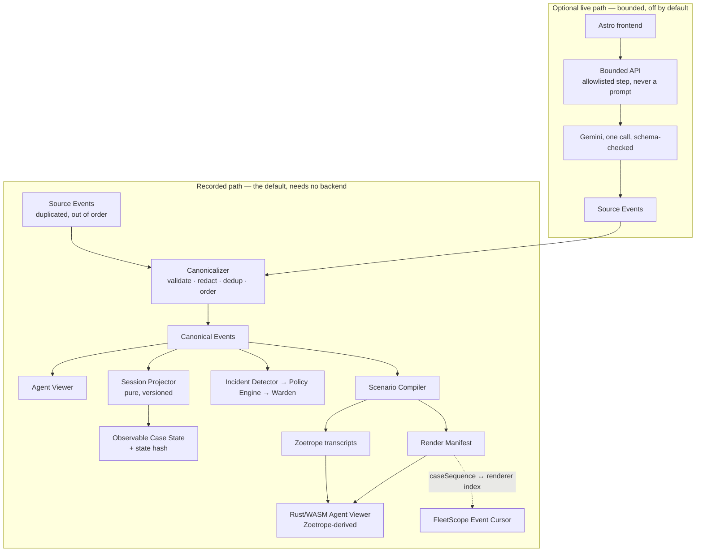

# FleetScope

FleetScope is a local-first, CLI-first **Agent Viewer** for one developer
watching Gemini/ADK multi-agent sessions, including Antigravity-style workflows.
It follows live local activity, replays recordings, scrubs the timeline, and
shows the root agent plus sub-agents and their prompts, tools, outputs, and
errors. A browser frontend shares the same portable projection core. More
providers, remote sessions, and enterprise governance come later.

## Quick start — the Agent Viewer

The viewer is a local command. It reads files on your disk, starts no agent,
sends nothing over the network, and needs no API key.

```bash
cargo run -p fleetscope-cli --bin fleetscope -- \
  crates/fleetscope-cli/tests/fixtures/gemini-multi-agent --follow
```

```text
fleetscope <path>                    replay a recording from the start
fleetscope <path> --follow           open parked at the live edge
fleetscope <path> --speed 4          replay speed multiplier
fleetscope <path> --format <id>      force a format instead of detecting one
fleetscope --formats                 list the formats this build can read
fleetscope inspect <path>            headless summary, no terminal UI
```

`<path>` is a session file or a directory containing one. A directory opens the
most recently modified session found in it or one level below, which is what
"show me what is happening" means in practice.

Launch options only choose the initial target and the initial playhead. Once the
viewer is running every transport action stays available from the keyboard:
`space` play/pause, `←`/`→` step, `g`/`G` start/end, `f` follow camera, `o`
overview, `?` help, `q` quit. `Live`, `Playing`, `Paused`, `History` and `Idle`
are derived from the playhead and the live edge, never from a flag captured at
startup, so nothing on the command line can put the viewer into a state the
keyboard cannot leave.

`inspect` is the headless answer, for a CI check, a pipe into grep, or a
terminal that cannot draw:

```text
$ fleetscope inspect crates/fleetscope-cli/tests/fixtures/gemini-multi-agent
session   inv-1
adapter   google-adk@1
agents    4
events    20
span      2026-08-28 09:00:00 → 2026-08-28 09:00:49

agents
  coordinator [completed]
    path coordinator  events 8  tools 0  errors 0
    flight_search [completed]
      path coordinator/flight_search  events 4  tools 1  errors 0
    hotel_search [failed]
      path coordinator/hotel_search  events 4  tools 2  errors 2
      ! search_hotels (fc-hotels-2) never returned
      ✗ search_hotels: error=upstream rate limit: 429 from partner API status=error
      ✗ search_hotels did not return within 30s
    itinerary_writer [completed]
      path coordinator/itinerary_writer  events 4  tools 1  errors 0
```

### Two rules the viewer does not bend

**Model reasoning is never rendered.** A Gemini part marked `thought: true` is
discarded at ingestion, before it can reach a label, a node or a detail panel.
The emitter never writes a `prompt` or `thinking` field, and this crate depends
on the renderer with `render-provenance` off, which is what draws those rows.
Three independent controls, because it is the one mistake that cannot be taken
back once it is on screen.

**Terminal state is never inferred.** An agent reads `completed` or `failed`
only because the session said so (`turnComplete`, `errorCode`, `escalate`).
Silence stays silence: an agent with no terminal event reads "no terminal event
recorded", and an unanswered tool call is reported by name. A stuck agent has to
look stuck.

### Supported input

| Format          | What it reads                                                                                                                                                                                                                                                                                |
| --------------- | -------------------------------------------------------------------------------------------------------------------------------------------------------------------------------------------------------------------------------------------------------------------------------------------- |
| `google-adk@1`  | Google ADK / Gemini sessions, in either envelope: a `Session` object with an `events` array, or a streamed log with one `Event` per line (the Antigravity-style shape). camelCase and snake_case field names are both accepted, because the Python SDK emits either depending on `by_alias`. |
| `claude-code@1` | Local sessions written as `<project>/<session>.jsonl` plus a `<session>/subagents/` tree beside it. The producer version is read off the transcript and reported.                                                                                                                            |

Detection is scored, and the two adapters decline each other outright, so the
choice never depends on registry order. A file nothing recognises is refused by
name and the error lists every readable format: drawing a confident graph of the
wrong thing is worse than declining the file. `--format <id>` forces one when
detection cannot place a session.

Adding a provider is an adapter and nothing else. The second one was added
without touching the viewer model, the wire emitter, `inspect`, or either
frontend.

### In the browser

`/viewer` is the same viewer as a page. It runs the same projection core
compiled to wasm, so it is not a second implementation that has to be kept in
agreement: it reports the same `projection` fingerprint the CLI prints for the
same session, and that value is pinned by a test.

```bash
pnpm build:wasm     # builds both browser frontends into apps/web/public/wasm
pnpm dev            # then open http://localhost:4321/viewer
```

It opens on the bundled demo (the same fixture the tests use, compiled in), and
accepts a dropped file or a picked folder. Folder selection matters for formats
that write a transcript plus a tree of per-agent files beside it: the file alone
shows the spawn and none of the work. Files are read in the browser. There is no
fetch in the load path and no backend to send a session to.

**Known issue, pre-existing:** the WebGL grid the graph draws into comes out
zero columns wide in some environments, so the canvas renders blank while the
status line, the summary and the fingerprint are all correct. This affects the
existing `/cockpit` route identically and is in the vendored renderer's
terminal backend, not in the projection. Until it is fixed, `fleetscope inspect`
and the page's own summary are the reliable way to read a session, and the
terminal frontend draws the graph correctly.

### Known limitation: graph depth

The rendering substrate's agent graph is one level deep — a sub-agent's parent
is the main node. A session nested deeper still loads and still shows every
agent, with its real path kept in the label, but the graph draws them all under
the root and the viewer says so. `fleetscope inspect` always prints the true
tree, so the depth is never lost, only un-drawn.

## Architecture



The default, demo, and public path requires **zero backend availability**: the
static build inlines recorded evidence, so the product works with the network
disabled after first load.

## Repository map

| Path                         | What it is                                                                                                                                                                                                   |
| ---------------------------- | ------------------------------------------------------------------------------------------------------------------------------------------------------------------------------------------------------------ |
| `apps/web`                   | Astro product shell (static output). Catalog, Cases, Approvals, Cockpit mount, Audit.                                                                                                                        |
| `apps/api`                   | One small Hono service: `/health`, `/capability`, one bounded live proof. Optional.                                                                                                                          |
| `packages/domain`            | The FleetScope vocabulary. Framework-independent.                                                                                                                                                            |
| `packages/event-schema`      | Canonical Event envelope, the closed event-type set, JSONL codec, generated JSON Schema.                                                                                                                     |
| `packages/projector`         | The versioned **pure** Session Projector and the state-hash contract.                                                                                                                                        |
| `packages/fixtures`          | Recorded Case evidence — a product asset, not a test leftover.                                                                                                                                               |
| `packages/canonicalizer`     | **The primary redaction boundary.** Validate → redact → dedup → order → Canonical Event.                                                                                                                     |
| `packages/scenario-compiler` | Canonical Events → renderer transcripts **+ the Render Manifest**, behind `RendererAdapter`.                                                                                                                 |
| `packages/warden`            | Incident Detector, Policy Engine, and the Intervention lifecycle with at-most-once execution.                                                                                                                |
| `packages/platform-adapters` | The seven adapter interfaces, their `recorded / synthetic / live / unavailable` modes, and the capability truth table.                                                                                       |
| `packages/shared`            | Canonical JSON, SHA-256, `Result`, central config parsing, the live-mode guard.                                                                                                                              |
| `crates/agent-viewer-core`   | Rust, **portable and IO-free**: provider adapters, the viewer model, the renderer wire emitter, `inspect`. Compiles for the host and for wasm32, which is what makes native and browser the same projection. |
| `crates/fleetscope-cli`      | Rust, the **`fleetscope` command**: local discovery, tailing, the terminal frontend.                                                                                                                         |
| `crates/fleet-cockpit`       | Rust, **host-testable**: Render Manifest, Event Cursor, scene loading over the vendored renderer.                                                                                                            |
| `crates/fleet-cockpit-web`   | Rust, **wasm32-only**, its own workspace: the browser shell and the `fleetscope_*` ABI.                                                                                                                      |
| `vendor/zoetrope`            | The pinned MIT renderer. See `vendor/VENDOR-PATCHES.md` — it is **patched**, not pristine.                                                                                                                   |
| `docs/`                      | Product, requirements, design, plans, decisions, reports, `architecture.md`.                                                                                                                                 |
| `scripts/`                   | `typecheck.sh`, `build-wasm.sh`, `smoke.sh`, `bless-fixtures.ts`, `recorded-run.ts`, `recorded-reliability.ts`.                                                                                              |

Dependency rules and per-package responsibilities: **`docs/architecture.md`**.

## Prerequisites

| Tool                     | Version                           | Notes                                                        |
| ------------------------ | --------------------------------- | ------------------------------------------------------------ |
| Node                     | **22.x** (verified on 22.18.0)    | `engines` requires `>=22`.                                   |
| pnpm                     | **11.x** (verified on 11.24.0)    | `corepack enable` installs the pinned version.               |
| Rust / Cargo             | **1.90.0** verified, 1.82 minimum | `rust-toolchain.toml` pins stable + rustfmt + clippy.        |
| `wasm32-unknown-unknown` | —                                 | `rustup target add wasm32-unknown-unknown`                   |
| `trunk`                  | latest                            | **Not installed by default.** `cargo install --locked trunk` |

Only `trunk` is optional: everything except the bundled WASM artifact builds and
tests without it.

## Local setup

```bash
git clone <repo> && cd FleetScope
corepack enable
pnpm install

cp .env.example .env          # optional; every default is already safe

pnpm dev                      # Astro at http://localhost:4321 → /cases
```

That is the whole setup for normal development. No cloud project, no credential,
and no model call is involved.

Other entry points:

```bash
pnpm dev:web                  # Astro only
pnpm dev:api                  # bounded API on :8080 (optional)

pnpm build                    # static site
pnpm build:web
pnpm build:wasm               # requires trunk

pnpm scenario:compile CASE-1042   # canonical events → Cockpit transcript
pnpm fixtures:bless               # regenerate blessed hashes AND renderer artifacts
pnpm schema:emit                  # regenerate JSON Schema from Zod

pnpm recorded:run             # one complete Recorded Case run, as one JSON line
pnpm reliability              # ten consecutive cold runs, compared field by field

pnpm check                    # format + lint + typecheck + test + build
pnpm smoke                    # the above plus Rust, the vendored renderer, and WASM
```

## Recorded mode

`LIVE_MODE=false` is the default and the **safe** default. It fails closed: only
the literal string `"true"` enables live mode, so a typo or an unset variable both
mean recorded-only.

In recorded mode:

- `apps/web` renders entirely from `packages/fixtures` inlined at build time;
- the projector reads canonical events and computes state and hashes locally;
- `apps/api` is not required at all, and if it is running it refuses every live
  request with `409 live_mode_disabled` and names the recorded fallback.

Every surface labels its execution mode — _Recorded Case_, _Live proof_,
_Synthetic system_, _Simulated day boundary_ — so recorded evidence can never be
mistaken for a live platform result.

## Live mode

Optional, bounded, and off unless deliberately enabled. Turning it on requires
`LIVE_MODE=true` **plus** `GEMINI_MODEL` and `GEMINI_API_KEY`; the service refuses
to boot otherwise, naming the missing variable and never a value.

Guardrails, all enforced in code:

- only allowlisted `(caseId, stepId)` pairs are accepted — **there is no
  free-form prompt endpoint anywhere in the service**;
- at most `GEMINI_MAX_CALLS_PER_CASE` (default 2) model calls per Case;
- 2,000 input / 300 output tokens, temperature 0, 15 s timeout by default;
- Cloud Run runs `min-instances=0`, `max-instances=1`, with no worker.

One call, no retry, and a response that must satisfy a schema or the call counts
as failed. `/live/decision` returns **Source Events**, never a rendered result:
the client canonicalizes them onto its stream, projects, compiles and appends, so
a live result becomes canonical evidence before it reaches an authoritative
surface. A failure returns `200` with `mode: "recorded"` and records the attempt
as evidence — FleetScope never fabricates a live success.

**Executed: 3/3 live runs passed against the real Gemini API, ~USD 0.0007 total**
— about 0.002% of the USD 35 ceiling. Reproduce with
`bash scripts/live-reliability.sh 3`. Every unit test still injects a `fetch`
that stays in-process, so the bounded path runs in CI for free.
See `docs/decisions/0003-bounded-live-path.md`.

If the API reports `API_KEY_INVALID` on a key you know is good, check for a
`GEMINI_API_KEY` exported in your shell profile: Node's `--env-file` does not
override an already-set variable, so an ambient value silently shadows `.env`.

### Running the live proof from the UI

The Cockpit carries a **Run Live Proof** control. It reads `GET /capability` and
stays disabled unless the API reports `liveMode: true` _and_ lists the step —
frontend configuration is never treated as evidence of a capability.

Because the static site and the API are separate origins, the browser call needs
an explicit CORS grant. `WEB_ORIGINS` is an exact-match allowlist and is **empty
by default**: with no entry the service sends no CORS header at all.

```bash
LIVE_MODE=true WEB_ORIGINS=http://localhost:4321 \
GEMINI_MODEL=gemini-2.5-flash GEMINI_API_KEY=…    npx tsx apps/api/src/server.ts

PUBLIC_API_BASE_URL=http://localhost:8080 PUBLIC_LIVE_MODE=true pnpm build:web
```

The browser canonicalizes the returned Source Events onto its own stream,
projects, compiles and appends — refusing the append outright if the recorded
prefix would recompile differently. The raw model response is never rendered.

Never boot the normal UI with credentials. It does not need them.

## Testing

```bash
pnpm test                     # all TypeScript tests
pnpm test:unit                # domain, schema, config, compiler, api guards
pnpm test:replay              # projector determinism + CASE-1042 fixture proofs
pnpm typecheck                # every package + astro check
pnpm lint
pnpm format:check

cargo test                    # FleetScope Rust, incl. the real Zoetrope integration
cargo test -p fleetscope-cli  # ingestion, the wire contract, the fold, the command surface

# The projection core must keep compiling for the browser target, or native and
# browser stop being the same code.
cargo check -p agent-viewer-core --target wasm32-unknown-unknown
cargo fmt --all -- --check
cargo clippy --all-targets -- -D warnings

# The vendored renderer, on its own terms — must stay green after every patch.
cargo test  --manifest-path vendor/zoetrope/Cargo.toml
cargo check --manifest-path vendor/zoetrope/Cargo.toml --no-default-features

# The wasm-only browser crate (its own workspace).
cargo check --manifest-path crates/fleet-cockpit-web/Cargo.toml \
            --target wasm32-unknown-unknown

pnpm smoke                    # everything above, with explicit PASS/FAIL/SKIP
pnpm reliability              # ten cold Recorded Case runs, compared field by field

# Real Chromium against the built site. Requires `pnpm build:web` first.
pnpm qa:browser               # 82 checks: every route at 1440x900, 1280x720, 1180x800
FLEETSCOPE_QA_SHOTS=/tmp/shots pnpm qa:browser    # also writes screenshots
FLEETSCOPE_QA_LIVE=true pnpm qa:browser           # +6 checks; spends one real model call
```

`pnpm qa:browser` covers what no unit test can: that the WASM renderer
instantiated, that clicking an evidence row moved the renderer to the **manifest
range** for that Canonical Event (not a ratio), that historical mode says nothing
is executing, that the evidence export verifies in the browser, that primary
navigation is keyboard reachable, and that no route gives the BODY a horizontal
scrollbar at any supported size.

| Suite                                                 |                                                        Tests |
| ----------------------------------------------------- | -----------------------------------------------------------: |
| TypeScript (`pnpm test`)                              |                                      **271** across 15 files |
| FleetScope Rust (`cargo test`)                        |            **53** — 9 lib, 12 cursor, 23 scene, 9 transcript |
| Vendored Zoetrope (`cargo test` in `vendor/zoetrope`) | **190** — 182 lib + 8 bin, unchanged by FleetScope's patches |

`pnpm test:replay` is the load-bearing one: it proves that the same canonical
prefix and projector version yield the same Observable Case State hash, and that
the fixture upholds the product invariants (blocked input never used downstream,
intervention states never collapsed, every badge traceable to an event).

`crates/fleet-cockpit/tests/scene.rs` is the other: it folds the real compiled
CASE-1042 through the real vendored renderer **on the host**, so "the Cockpit
renders what FleetScope says it does" is checked by `cargo test` rather than
discovered in a browser.

## Licensing

FleetScope is MIT licensed — see `LICENSE`.

Third-party attribution lives in **`THIRD-PARTY-NOTICES.md`**, and only there:
per product decision D8, notices stay in repository licensing files and do not
appear in product navigation.

The Agent Viewer renders on **Zoetrope** (MIT, © 2026 Furkan Kalaycioglu),
vendored at `vendor/zoetrope/` and pinned to
`077707da679955c0402c39ca992bf56cdc6b0264`. It is **not unmodified** — FleetScope
carries a small patchset, recorded in full in **`vendor/VENDOR-PATCHES.md`**.
Upstream's own suite (182 library + 8 binary tests) passes unchanged after it.
