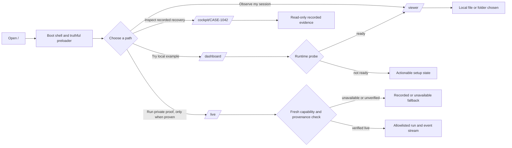
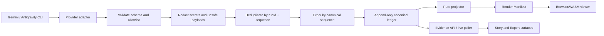

# FleetScope frontend experience

> **Scope note:** this document is retained for public launchpad/onboarding
> shell mechanics only. Its enterprise Case/Cockpit narrative and all old live
> demo claims are historical. The current product and demo UX contract is the
> [Session Observer](session-observer.md).

**Status:** legacy shell reference — do not use for product/demo scope  
**Owner:** FleetScope product and frontend  
**Scope:** cross-route public launchpad, onboarding, dashboard, and frontend composition  
**Last updated:** 2026-08-30

This is the canonical design for the public FleetScope entry experience and
the contracts that connect it to the local viewer and the bounded live demo. It
is a design specification, not an implementation report. It does not install
React Bits or OriginKit, change application code, or treat a screenshot as
proof that a runtime feature exists.

The existing Agent Workspace pack remains authoritative for `/live`. The
Zoetrope-derived viewer remains authoritative for local session rendering. This
document owns the public launchpad (`/`), onboarding composition, dashboard
states, and the cross-route hand-off between those surfaces.

## 0. Historical demo hierarchy (superseded)

The CASE-1042 hierarchy below is retained as historical context and is not the
current submission experience. The active demo is a Google ADK
`google-cloud-launch-readiness` session that writes JSONL; FleetScope observes,
graphs, follows, and replays it. Read the Session Observer product/design docs
for the active hierarchy and claims.

Every route therefore derives its execution label from evidence:

| Evidence available | Label | Allowed action |
|---|---|---|
| Verified cloud run, model/framework/deployment/run IDs | `Live` | Only the allowlisted private scenario/control |
| Local API/MCP/ADK contract without cloud proof | `Local control` | Inspect/rehearse; no hackathon-readiness claim |
| Bundled CASE-1042 events | `Recorded` | Replay, scrub, inspect; no active controls |
| Missing or stale capability/deployment evidence | `Unverified` | Explain the gap and offer recorded fallback |

The landing page may route a judge to the private live proof when the capability
manifest is fresh. If any gate is absent, it must route to the recorded story
and name the missing artifact rather than displaying a green live state.

## 1. Mission, audience, and promise

FleetScope makes agent work legible without turning a demo into a claims
machine. A visitor should understand what FleetScope can observe, choose the
right path, and reach a truthful result in one or two deliberate actions.

### Audiences

| Audience | Immediate job | Frontend promise |
|---|---|---|
| First-time developer | See what the tool does and open a local session | Start with a bundled example, then connect a session already on this machine |
| Agent operator | Follow or replay work and inspect an event | One cursor, one projection, clear live versus recorded language |
| Hackathon judge | Verify real asynchronous agent behavior quickly | A short path from launchpad to a bounded recovery run and its evidence |
| Security or product reviewer | Distinguish proof from presentation | Every governance claim links to a canonical event or is explicitly marked unknown |

### Product promise

> **Watch agent work become evidence.**

The public copy may promise observation, replay, and governed evidence. It may
not promise autonomous recovery, a provider action, delegation, or a Google
Cloud deployment until the corresponding event, runtime response, or deployment
proof exists.

### Modes of use

1. **Local observer:** the Gemini or Antigravity CLI runs on the developer's
   machine; FleetScope reads a chosen transcript locally and never uploads it.
2. **Bounded live proof:** an explicitly enabled API admits one allowlisted
   scenario, receives validated events, and exposes the resulting evidence.
3. **Recorded fallback:** static fixtures let a visitor inspect the same
   presentation when no live service is available. The UI says `Recorded` or
   `Unavailable`; it never presents the fallback as a live run.

These modes are complementary. The fallback is not a substitute for the live
proof required by the hackathon rubric, and the live proof is not a reason to
weaken local privacy guarantees.

## 2. Source-of-truth hierarchy

When two documents or references disagree, use this order. A lower row may
compose or link to a higher row but cannot silently override it.

| Priority | Source | Owns | Rule for this document |
|---:|---|---|---|
| 1 | Hackathon brief and supplied requirements (`goal-objective.md`, pasted rules) | Mandatory platform/model/framework requirements and submission proof | Gemini 3.5 or newer, one Google agent framework, and one Google Cloud service are gates, not marketing copy |
| 2 | [`docs/requirements/fleetscope.md`](../requirements/fleetscope.md) and its feature requirements | Product “what”, scope, and success outcomes | This document maps the frontend to those outcomes; it does not redefine them |
| 3 | [`docs/design/system.md`](system.md) and [`docs/decisions/`](../decisions/) | Event, security, ownership, and failure contracts | Frontend displays these facts and never becomes an enforcement layer |
| 4 | [`agent-workspace/10-design-decisions.md`](agent-workspace/10-design-decisions.md), [`11-coding-handoff.md`](agent-workspace/11-coding-handoff.md), and [`12-acceptance-gate.md`](agent-workspace/12-acceptance-gate.md) | `/live` Story/Expert state, vocabulary, visual budgets, and test gate | These files override any launchpad or visual suggestion here when `/live` is involved |
| 5 | [`docs/plans/zoetrope-audit-and-implementation-plan.md`](../plans/zoetrope-audit-and-implementation-plan.md) and the Zoetrope reference | Local CLI/WASM architecture, event sourcing, two clocks, and graph boundary | The graph stays on `/viewer`; this document does not invent an event-to-graph adapter |
| 6 | This document | `/` launchpad, onboarding/preloader, dashboard composition, cross-route hand-off, and integration gates | New visual work is limited to these owned surfaces and remains evidence-aware |
| 7 | NeuroPay, React Bits, OriginKit, Blobatar, and other visual references | Interaction grammar and visual inspiration | References are not product requirements and cannot authorize unsupported claims |

### Explicit conflict resolutions

- The older enterprise UX material remains the CASE-1042 story for `/cases`,
  `/cockpit`, `/catalog`, `/approvals`, and `/audit`. The primary judge entry is
  the private cloud proof through those surfaces; Dashboard → local CLI/session
  → Agent Viewer remains the developer/privacy path and public fallback.
- The near-black, no-fake-motion Agent Workspace contract governs `/live`.
  The liquid-glass carousel, cream/paper treatments and marketing copy never
  enter `/live`, a Case surface, or an evidence drawer.
- **The `/viewer` frame is not governed by the `/live` rule.** An earlier
  revision of this document extended the near-black contract to the whole of
  `/viewer`. That was an over-reading rather than a product decision, and it is
  corrected here: the chrome around the viewer is shell, not evidence.
- **Two shell languages, one seam.** The product shell — `/dashboard` and the
  `/viewer` frame — is liquid glass. The public launchpad `/` is a separate,
  stricter system (see below). This is deliberate rather than accidental drift:
  a front door and a workspace are answering different questions, and the
  industry reference this page follows draws exactly the same line between its
  marketing site and its applications. What both share is the seam: neither
  language is allowed inside evidence.
- `/viewer` is the Zoetrope graph and replay surface. `/live` Expert Mode is
  the canonical event/evidence plane and has no graph until a real adapter and
  append policy are designed and verified.
- A local screenshot, a green unit test, or a configured environment variable
  is orientation only. Readiness, live execution, durability, and Cloud Run
  deployment require the evidence described in section 13.

### The seam: glass may hold evidence, it may never be evidence

The split is drawn by what a surface is *for*, not by which route it sits on.

| Role | Language | Where | Why |
|---|---|---|---|
| Public launchpad | Apple-minimal: true black and `#101010`, one accent, 64–140px type, one idea per viewport, no glass and no gradients | `/` only, via `apple.css` | A first-time visitor has read nothing. One statement per screen, and the product as the only decoration. |
| Product shell | Liquid glass | `/dashboard`, the `/viewer` frame, panel chrome — via `glass.css` and `surface="glass"` | These surfaces invite and orient someone already inside the product. |
| Evidence | Flat operational palette from `system.md` | Terminal output, the viewer canvas, event lists, payloads, drawers, `/live` Story and Expert, Case and Audit | Read closely by someone checking a claim. Translucency behind such text buys nothing and costs contrast. |

Concretely: the frame around `/viewer` is glass; the terminal window, the graph
canvas and the event detail inside it stay on the opaque dark palette. In the
implementation this is one class, `.fs-glass__well`, plus a role-scoped rule
under `[data-surface='glass']`.

The launchpad shares no stylesheet with the app. `global.css` sets
`h2 { font-size: 12px; text-transform: uppercase }` — correct for a dense
console section label, and a direct contradiction of a page whose section
headlines are 88px. `apple.css` therefore carries its own small reset rather
than overriding the app rule by rule.

The launchpad's design system is encoded in
[`apps/web/src/styles/apple.css`](../../apps/web/src/styles/apple.css), and its
prohibitions are enforced in CI-able form by `pnpm qa:landing`.

#### The launchpad is a cloned layout

`/` is not a scrolling document. It is a single viewport: a row of cards drawn
in WebGL under a fullscreen liquid-glass lens, with the wordmark top-left, a
locator centred above the row, a counter centred below, two quiet corner
labels, and a Close that appears only in focus mode. That composition is cloned
from the NeuroPay landing page at commit `010d0ec1`.

Three things are deliberately **not** cloned:

1. **The typography.** The reference sets its overlay in a monospace display
   face at wide tracking. This page uses the launchpad's own system — one
   grotesque, weights at or under 600, negative tracking on large sizes, and
   uppercase reserved for eyebrow-class micro-labels.
2. **The mobile behaviour.** The reference shows a "Desktop only — 1024px+"
   holding screen. FleetScope's own rules forbid that dead end, so below the
   gate the card list *is* the page: eight links with headings, summaries and
   provenance, all present.
3. **The scroll containment.** The reference is a single screen with nothing
   after it and can consume every wheel event. This page has the card list
   below, so when the row is clamped at either end and the gesture pushes
   further, the event is not consumed and the page scrolls on. A carousel that
   swallows all vertical scrolling is a trap.

The cards are photographs of eight real routes of this build, captured by
`pnpm shots`. Nothing is generated artwork or a mockup: the row is the product.

The lens mathematics, the layout model and the motion tunables are adapted from
the MIT-licensed `liquid-glass-carousel` engine reached via that commit; see
[`THIRD-PARTY-NOTICES.md`](../../THIRD-PARTY-NOTICES.md). Its **dark-page**
tuning is used rather than its upstream defaults, and its lens geometry is used
verbatim — `sizeX 0.565, sizeY 1.0`, which makes the ellipse twice the height of
the viewport so only its smooth interior is ever visible.

## 3. Route ownership and navigation

The route table is an ownership boundary, not only a sitemap.

| Route | Owner | Primary question | Allowed visual language | Evidence boundary |
|---|---|---|---|---|
| `/` | Public launchpad | Why should I try FleetScope, and where do I start? | One-viewport WebGL card row under a liquid-glass lens, with Apple-minimal typography; a hairline card list is the content beneath it | Cards are real routes of this build; no card may claim a run |
| `/dashboard` | Onboarding shell | Is this browser runtime ready, and what should I do next? | Liquid-glass shell, concise setup states, opaque terminal preview | Browser reports only probes it can actually perform |
| `/viewer` | Zoetrope/WASM observer | What happened in this local session? | Liquid-glass frame around an operational canvas, graph, timeline and replay controls | Local files stay local; no enterprise or Warden claims |
| `/live` | Bounded recovery surface | What did this governed run prove? | Agent Workspace near-black Story/Expert contract | `/live` defers entirely to the normative pack |
| `/cockpit/:caseId` | Enterprise Case surface | What happened in this Case? | Story/Expert design with live/recorded labels | Verified private run or Case fixture; never inferred from route |
| `/cases` and `/cases/:caseId` | Enterprise Case navigation | Which Case should I open? | Existing product plan | No new launchpad behavior |
| `/catalog` | Agent discovery | Which approved agent version can I launch? | Existing enterprise reference | A catalog card is not proof of execution |
| `/approvals` | Governance | What decision needs an explicit approval? | Existing enterprise reference | Approval state must be event-backed |
| `/audit/:caseId` | Evidence export/review | Can I reconstruct the complete record? | Existing enterprise reference | Read-only projection; no side effects |

### Public navigation

The public header has one primary action that is derived from the capability
manifest: `Open CASE-1042` for a fresh verified private run, otherwise `Open
Agent Viewer`. `See recorded recovery` remains secondary. Navigation must not
imply that a browser can enumerate the user's disk or start their CLI.

The current worktree has an in-flight navigation change and untracked
`/dashboard` and `/` additions. Before implementation, reconcile the current
branch and listener ownership; do not treat the redirect or a local preview as
deployment truth.

## 4. Wow onboarding journey and state model

“Wow” comes from a fast, honest reveal: the product shows the private governed
CASE-1042 run when its live proof is verified, and otherwise shows the real
local/recorded example without pretending that a background agent is running.
The journey has one focal decision at each step.



### Launch state versus run state

The launchpad and dashboard use a small route-level state machine. It must not
be confused with `LiveState` in `features/live/state.ts` or with the twelve
states in the Agent Workspace pack.

| Launch state | Entry condition | Primary copy | Permitted action |
|---|---|---|---|
| `booting` | Static shell has not completed concrete readiness checks | `Preparing the local viewer` | Skip or wait |
| `ready` | Required shell assets and optional manifest are available | `Your workspace is ready` | Open Viewer or choose a path |
| `local_only` | No live capability is reachable, or the visitor chooses local mode | `Runs stay on this machine` | Open Dashboard/Viewer |
| `live_available` | Capability response is fresh and advertises an allowlisted scenario | `A bounded live proof is available` | Open `/live` |
| `recorded_only` | Live service is absent or explicitly disabled | `Explore the recorded proof` | Open recorded Case |
| `degraded` | A required probe failed or a manifest is invalid | `We could not verify that yet` | Retry, use local path, or read details |

The state is derived from observations, not from a timer, CSS class, or route
name. A stale capability response expires and returns to `recorded_only` or
`local_only`; it never keeps a green live badge indefinitely.

### Onboarding sequence

1. The launchpad explains the local boundary before asking for a file or
   credential.
2. The preloader waits for concrete shell/runtime facts and can be skipped.
3. The visitor chooses `Open Agent Viewer`, `Try bundled session`, or
   `See governed recovery`.
4. Dashboard reports the WASM runtime and adapter formats it actually loaded;
   CLI installation and filesystem enumeration remain manual instructions.
5. Viewer opens a chosen file/folder or the bundled demo. It reports whether a
   real projection succeeded.
6. The live path is a separate opt-in action. It displays the capability,
   scenario name, budget boundary, and provenance before `Start`.

## 5. Truthful preloader contract

The preloader is a transition aid, not a progress simulation.

### Inputs it may use

- static HTML/CSS readiness;
- font readiness if a font is actually required;
- the browser WASM module load and exported ABI check;
- a bundled render manifest checksum, if shipped;
- a live capability response, only when the user explicitly asks to inspect
  live proof.

It may not use a guessed percentage, elapsed time, a fake terminal transcript,
or an animation whose completion implies that a model or worker ran.

### Behavior

- Server-render the usable shell first; the page remains understandable with
  JavaScript disabled.
- Show a short, textual status line such as `Loading the local viewer` and a
  determinate indicator only when a real count is available.
- Provide `Skip` after the first paint and always honor it.
- If a required probe exceeds its bounded timeout, replace the preloader with
  `The viewer could not be verified` plus `Retry`, `Use recorded example`, and
  the diagnostic detail.
- On `prefers-reduced-motion: reduce`, switch states immediately and remove
  all decorative transitions.
- Never block the recorded fallback on a live API, a license registry, or
  WebGL.
- Announce state changes through one polite live region; do not repeatedly
  announce polling ticks.

### Preloader acceptance

1. Every hidden state has a corresponding observable readiness input.
2. Reloading with the API offline still reaches a usable local or recorded
   path.
3. The screen never says `Ready`, `Live`, `Connected`, or `Running` before the
   named probe has succeeded.
4. The skip path leaves no pending promise that later overwrites a user's
   chosen route state.

## 6. Landing-page wireframe and copy

The launchpad is a public invitation, not an operations dashboard. It has one
focal object, generous negative space, and a clear hand-off to the product.

```text
┌──────────────────────────────────────────────────────────────┐
│ FleetScope                         How it works   Open Viewer │
│                                                              │
│              Watch agent work become evidence.               │
│    Follow a local Gemini session or inspect a governed run.  │
│                                                              │
│        [Open Agent Viewer]   [See recorded recovery]         │
│                                                              │
│       [optional chapter carousel / liquid-glass lens]        │
│                                                              │
│   Local by default · Event-sourced · Replayable · Bounded    │
└──────────────────────────────────────────────────────────────┘
```

### Content rules

- Hero headline: `Watch agent work become evidence.`
- Verified-live supporting line: `Follow CASE-1042 from approved agent to
  confirmed recovery on a private Google Cloud run.`
- Fallback supporting line: `Follow a local Gemini or Antigravity session, or
  inspect a bounded recovery record with the evidence behind it.`
- Primary CTA for a fresh verified live manifest: `Open CASE-1042` →
  `/cockpit/CASE-1042`; otherwise `Open Agent Viewer` → `/viewer`.
- Secondary CTA: `See recorded recovery` → `/cockpit/CASE-1042` or the
  verified recorded route.
- Public live CTA (optional): `Run live recovery proof` appears only when the
  capability response and policy allow it; otherwise it is not disabled-looking
  theatre, it is absent or replaced with `Live proof unavailable` and a reason.
  This public-UI choice does not waive the separate mandatory private
  submission-proof gate in section 13.
- Trust strip: `Local files stay local`, `One event cursor`, `Replay without side effects`.
- Chapter labels are factual (`Observe`, `Replay`, `Govern`) and do not claim
  that a model acted.

### Layout and visual limits

The launchpad may use a dark base and rare cyan/violet accents to connect it to
the operational product. It must not reproduce the `/live` Story surface,
introduce a rainbow palette, or put a dense event grid behind the hero. The
carousel is optional: if WebGL or its assets fail, the headline and CTAs remain
the complete page.

The landing page is not the place to show raw prompts, event payloads, API keys,
Cloud project identifiers, or a fabricated agent count.

## 7. Liquid-glass carousel contract

The interaction reference is the MIT-licensed NeuroPay commit
[`010d0ec187e038e6e57d945f63b57fd21ad373a9`](https://github.com/musashi0x/NeuroPay/commit/010d0ec187e038e6e57d945f63b57fd21ad373a9).
Its useful grammar is an infinite visual row of repeated meshes, a fullscreen
FBO/liquid lens, wheel and drag momentum, idle snap, click-to-center, focus mode,
and separate locator/counter/caption controls. The commit is a reference, not a
permission to copy its payment content or artwork.

### Data contract

Each card is generated from a verified launchpad manifest:

```ts
type LaunchChapter = {
  id: string;
  title: string;
  summary: string;
  route: string;
  eventRef?: { runId: string; sequence: number };
  provenance: 'bundled' | 'recorded' | 'live';
  accent: 'neutral' | 'cyan' | 'violet' | 'orange';
};
```

The visual loop may repeat meshes for an infinite feel, but the locator and
counter describe the finite manifest. A card without an `eventRef` cannot say
that an event happened. A `live` card requires a fresh capability/run proof.
Never copy NeuroPay's BNB, USDC, payment, pricing, or artwork content.

### Interaction contract

- Desktop enhancement gate: `min-width: 1025px`; below it, use a static card
  row or native horizontal scroll with the same links and labels.
- Wheel, pointer drag, and flick momentum all settle to the same centered card.
- Click-to-center never navigates unexpectedly; a second deliberate activation
  opens the card route.
- Focus mode exposes the title, summary, provenance, and one route action; it
  provides a visible close control and restores focus to the invoking card.
- Locator and counter are supplementary. Keyboard focus and semantic buttons
  remain the source of interaction truth.
- Pause when the document is hidden, release WebGL resources on unmount, and
  handle context loss by switching to the static fallback.

### Accessibility and motion

- Use an ARIA carousel only if the implementation can expose a real list of
  slides, a labelled region, previous/next controls, and the active slide.
- Provide Home/End and Left/Right keyboard movement; do not require drag.
- `prefers-reduced-motion` disables momentum, bloom, lens animation, and idle
  snapping. The centered card changes immediately.
- Never encode provenance or state by colour alone. The words `Bundled`,
  `Recorded`, or `Live` are explicit and conditional.
- Lazy-mount the canvas after the hero is usable. A static image/card path must
  work with WebGL disabled, CSP restrictions, or a failed shader.
- Respect `devicePixelRatio` caps and a measured frame budget; do not let the
  effect delay the first meaningful paint.

### Mechanics observed in the reference commit

The NeuroPay source was read at the pinned commit rather than treated as a
generic “glass card” description. The reusable interaction pieces are:

- a fullscreen FBO/liquid-glass lens shader rather than a CSS blur on every
  card;
- a fixed panel height with aspect-ratio-driven widths, so the row remains
  stable while cards vary in shape;
- a repeated mesh pool that gives the finite row an infinite visual loop;
- wheel, pointer drag, flick momentum, idle snap, click-to-center, and a focus
  mode with its own close path;
- separate locator, counter, focus caption, cursor label, and close controls;
- an entry sequence that raises panels from below, staggers their growth, and
  blooms the lens.

The reference uses a desktop gate at `1025px`, a static holding screen below it,
and a configuration shape exemplified by `PAGE_BG=0x05060a`, `PANEL_H=600`,
`GAP=28`, and reduced gold lens settings. These are starting measurements, not
FleetScope tokens: tune them against the launchpad budget, retain the static
fallback, and do not let entry bloom imply that a run has started.

### Attribution and safety

If the NeuroPay engine is reused, retain its MIT copyright and license notice in
the source and record the adapted files in the implementation handoff. Keep
all card text and assets FleetScope-owned or properly licensed. Never pass raw
event payloads or secrets into a shader uniform, URL, or card metadata.

### FleetScope deltas, tunables, and evidence gates

The pinned NeuroPay implementation is a useful interaction reference, not a
drop-in component. The following table is the minimum delta record to carry
into an implementation handoff. Values marked as starting points must be
measured at the accepted viewports before the carousel is enabled.

| NeuroPay observation | FleetScope decision/tunable | Required evidence gate |
|---|---|---|
| `REPEATS = 4` gives an infinite-looking mesh pool | A repeated pool may be used, but the finite `LaunchChapter.id` and manifest index remain the semantic identity. Clone index is never an event key. | Keyboard/locator test selects the same manifest item after wrapping; no duplicate event or route claim appears. |
| Fixed `PANEL_H`, aspect-derived widths, and `GAP` keep the row stable | Keep one fixed panel-height token and aspect-derived width; tune `PANEL_H`, `GAP`, and repeat count per viewport without changing the manifest. | Geometry snapshots at 1440×900, 1280×720, 1180×800, 1024×800, and a narrow viewport show no clipping or body overflow. |
| Scroll speed shrinks panels by up to 25% | Cap speed-derived shrink at 25%; clamp at both ends and disable it in reduced-motion mode. | A measured wheel/drag run records the clamp and reduced-motion snapshot has no shrink or momentum. |
| Mouse and touch use different drag/flick thresholds | Preserve modality-specific thresholds and expose an equivalent click/keyboard path. | Pointer, touch, keyboard, and click tests each reach the same centered chapter. |
| Entry defaults include delay `0.5s`, rise `1s`, grow `2.15s`, and lens bloom `1.4s` | Treat these as tuning references only. Derive all entry offsets/delays from a deterministic seed stored with the render config; no `Math.random()` or wall-clock randomness is allowed in render code. | Two reloads with the same manifest and seed produce the same transform/delay sequence; a changed seed is the only intentional variation. Reduced motion enters the settled state immediately. |
| DPR is capped at `2`; textures use mipmaps/anisotropy | Cap canvas DPR at `min(devicePixelRatio, 2)` (with a lower adaptive cap when the measured budget is missed). Enable mipmaps/anisotropy only when supported and never make them a readiness dependency. | Record CSS size, backing-store size, effective DPR, GPU/context status, and frame timings in the QA report. |
| Fullscreen FBO/lens shader is the visual signature | Load the lens lazily after the semantic hero. A missing asset, shader compile/link error, CSP/WebGL denial, zero-size host, or context loss switches to the same content-complete static/native row. | Force each failure (including `webglcontextlost`) and verify title, summary, provenance, focus order, and route action remain usable. No `Live` label is added by the fallback. |
| Entry choreography uses `Math.random()` and can differ by reload | FleetScope's seed is explicit (for example, `renderSeed` in the launch manifest or a documented release seed), stable for replay, and never derived from a secret or event payload. | Snapshot/property test proves deterministic output and that replaying a run does not advance or mutate the seed. |
| Mobile reference shows a “Desktop only” holding screen | FleetScope intentionally does not use a holding screen. At and below the desktop enhancement gate it renders semantic cards or native horizontal scroll with all content and actions present. | Narrow/mobile browser test completes the launch path with WebGL disabled and no “desktop only” dead end. |
| Card text is baked into PNG textures | Keep readable DOM headings, summaries, provenance labels, and links outside the canvas. Texture text is decorative only and may not be the sole source of meaning. | Screen-reader, keyboard, zoom, forced-colors, and text-selection checks pass with the canvas removed. |
| Reference includes `liquid-glass-carousel` attribution and `packages/carousel/LICENSE` | If code or shader logic is adapted, preserve the MIT notice, link the pinned commit, list adapted files, and include attribution in the release/handoff record. | License review has a checked source notice and an asset provenance list; no unlicensed artwork or payment copy is shipped. |

#### Lifecycle and performance budget

The carousel is a disposable enhancement. It may mount only after the hero has
painted and its host has a non-zero measured size. While mounted it must pause
when `document.visibilityState !== 'visible'`, when the section is outside the
viewport, and whenever reduced motion is enabled. Unmount must dispose the
renderer, FBOs, textures, materials, animation frames, observers, and event
listeners; context restoration may reconstruct them only after a fresh size
measurement. A route change must not leave a render loop or GPU resource alive.

For the launchpad gate, target a 60 Hz frame budget (≤16.7 ms per frame) at
1440×900 and keep the enhancement off the critical path. Measure a warm
10-second window after entry; if two consecutive one-second windows fall below
45 FPS or exceed a 22 ms median frame, disable the lens and retain the static
row. Record first meaningful paint and hero interaction readiness separately;
the carousel must not delay either. The QA artifact records viewport, browser,
effective DPR, frame distribution, context-loss result, and whether fallback
was selected. These are proposed launchpad budgets and require an owner sign-off
before implementation; they do not describe current runtime performance.

## 8. Dashboard states and the local-only boundary

The current dashboard state contract in
[`apps/web/src/features/dashboard/state.ts`](../../apps/web/src/features/dashboard/state.ts)
is the source for the onboarding shell. Its states are:

| State | What the browser can prove | Required user-facing behavior |
|---|---|---|
| `first-run` | No probe has run | Explain local-only behavior and offer a runtime check |
| `checking-runtime` | Runtime probe is in flight | Disable racing actions and say what is being checked |
| `cli-missing` | Browser runtime failed to load | Offer retry and a terminal recovery command; do not claim the CLI is absent because the browser cannot see it |
| `workspace-required` | Runtime loaded; no session chosen | Ask the user to choose a file/folder or bundled demo |
| `adapter-failed` | Chosen input was rejected by every adapter | Explain the supported formats and offer another input |
| `no-sessions` | Chosen folder contained no recognized session | Explain the expected transcript/folder shape |
| `ready` | Runtime and a selected/projection path are ready | Open Agent Viewer; show only adapter facts returned by the runtime |

The browser cannot enumerate prior sessions, inspect whether `fleetscope` is
installed, or infer that Gemini is running in another terminal. Those remain
manual checks and must never appear as green setup cards. The bundled recording
is the only session that may be listed without a user choice.

### Local-only rules

- No local transcript, prompt, or key is uploaded by `/viewer` or Dashboard.
- The CLI owns its Gemini/Antigravity credential. FleetScope does not ask the
  browser for that credential.
- Live `/runs` controls are explicit, loopback-gated, and separate from local
  file viewing.
- A failed WASM load degrades to a terminal instruction or recorded content;
  it does not invent a graph.

### Dashboard state-to-launch mapping

Dashboard state is an implementation-facing observation; launch state is the
copy and route decision the visitor sees. Keep the mapping explicit so a probe
timeout cannot accidentally look like a successful run.

| Dashboard state | Launch state | Default next action | What is deliberately not claimed |
|---|---|---|---|
| `first-run` | `booting` until the first probe resolves, then `local_only` | `Check local viewer` or `Try bundled session` | No CLI, session, or network capability is inferred. |
| `checking-runtime` | `booting` | Wait, or `Skip to recorded example` | A spinner is not evidence that a runtime or agent is running. |
| `cli-missing` | `degraded` with `local_only` fallback | `Retry runtime`, `Choose a transcript`, or show the terminal recovery command | The browser cannot say that the Gemini/Antigravity CLI is absent; only the browser probe failed. |
| `workspace-required` | `local_only` | `Choose file/folder` or `Use bundled session` | No prior workspace/session list is fabricated. |
| `adapter-failed` | `degraded` | `Choose another input` or `Use bundled session` | The rejected input is not presented as a partial or live run. |
| `no-sessions` | `degraded` | `Choose another folder` or `Use bundled session` | An empty folder is not a running/connected CLI. |
| `ready` | `ready` | `Open Agent Viewer` | Only the selected input and adapter facts are asserted. |

The mapping is also the route hand-off contract: `ready` may open `/viewer`,
`local_only` may open `/dashboard` or `/viewer` with a local/recorded label,
`live_available` (from a fresh capability response) may offer `/live`, and
`degraded` must retain a recorded/local action. A route transition must carry
the state snapshot and provenance so a late probe cannot overwrite the route
the visitor selected.

### Timeout and offline wireframes

These are content wireframes for the two failure states that must be reviewed
at implementation time. They are not screenshots and do not imply that the
timeouts or offline handling are implemented yet.

```text
Dashboard · local observer
┌──────────────────────────────────────────────────────────────┐
│ Status: We could not verify the local viewer (timed out)      │
│ The browser did not receive a WASM probe result in 5 seconds. │
│ Your CLI and files stay on this machine.                     │
│                                                              │
│ [Retry check]  [Choose transcript]  [Use recorded example]   │
│ Details: probe=wasm · result=timeout · checked=just now      │
└──────────────────────────────────────────────────────────────┘
```

```text
Dashboard · live capability unavailable
┌──────────────────────────────────────────────────────────────┐
│ Recorded path                                                 │
│ Live proof is unavailable while the API is offline.           │
│ Nothing has started, and no model call was made by this page. │
│                                                              │
│ [See recorded recovery]  [Open local viewer]  [Retry]         │
│ Details: GET /runs/capability · network=offline              │
└──────────────────────────────────────────────────────────────┘
```

The timeout is bounded and visible in diagnostics, but copy must say what was
actually checked. `Offline`, `Unavailable`, and `Recorded` are explicit text
states; they are never represented only by a greyed-out button or colour.

### Dashboard happy-state wireframe

The happy state is a launch checklist, not a fabricated session dashboard. It
shows what the browser verified, what requires a user decision, and the one
next action that opens the viewer.

```text
Dashboard · local observer
┌──────────────────────────────────────────────────────────────┐
│ FleetScope                                      [Open Viewer] │
│ Your workspace is ready                                      │
│                                                              │
│ Runtime        Ready · WASM projection loaded               │
│ Formats        JSONL · JSON · adapter facts from this build  │
│ CLI install    Check in terminal                             │
│ Workspace      Choose a file or folder                       │
│                                                              │
│ [Choose local session]  [Try bundled session]                │
│                                                              │
│ Live proof     Recorded path · capability not verified       │
│               [See recorded recovery]                        │
└──────────────────────────────────────────────────────────────┘
```

`Runtime` and `Formats` are probe-backed rows. `CLI install` and `Workspace`
are explicit instructions or user actions, never green checks inferred by the
browser. The live-proof row is omitted when no capability endpoint is in scope;
when present, it must carry `Recorded`, `Unavailable`, or `Live` text from the
fresh capability response and may not make a public visitor wait for that
response. Every button has an equivalent native link or keyboard path, and the
bundled session remains reachable when the local runtime or live API fails.

## 9. CLI → adapter → canonical events → browser/WASM

The data path has two thin frontends over one meaning. The browser and native
CLI must converge on the same projection for the same event set.



### Responsibilities and invariants

| Stage | Owns | Invariant |
|---|---|---|
| CLI/provider adapter | Reading the provider's local format and attaching run/session identity | It never fabricates an event to fill a missing provider fact |
| Validation | Required fields, allowlisted event kinds, run correlation, sequence type | Invalid input is rejected and cannot become evidence |
| Redaction | Prompt/output/error minimization and secret/PII removal | Redaction happens before persistence and rendering |
| Deduplication/order | Idempotent retries and canonical sequence | Repeating a sequence is a no-op; late events do not create a second meaning |
| Ledger | Durable append and high-water mark | A committed event is readable after restart in the selected storage profile |
| Projector | Observable state, phase, provenance, and reversible rollups | Pure, deterministic, order-independent where the schema permits it |
| Render Manifest | Stable mapping from semantic IDs to event sequences and renderer IDs | `ViewerEvent.sequence` is canonical; `source_id` is not a unique event key |
| Browser/WASM | Local file selection, projection display, playback, and accessible controls | Replay performs zero model, tool, or Warden actions |
| Story/Expert adapter | Plain-language copy, evidence cards, mode state | A term appears only when a named event/capability field entitles it |

The manifest must preserve interleaved `SubagentMeta` records and map each
visible event by its canonical sequence. Never key a selection, drawer, or
replay row by `source_id` alone: that field can collide and the event schema has
no independent `event_id`. Canvas QA therefore checks dimensions and named
sequence selection, not merely that a canvas element exists.

### Zoetrope rules retained

- Treat transcripts and sidecars as append-only event logs; derive views by a
  pure fold rather than mutating a session model in place.
- A replay seeks an event prefix (`events[0..cursor]`) and must land on the
  same projection that live arrival would produce.
- Content-time (event timestamps/playhead) determines domain state. Presentation
  time (wall clock) may drive optional visual motion only and is never folded
  into state.
- A known completion event outranks an idle heuristic; a pending tool call
  outranks a guessed idle status.
- Live and replay are one model with a moving or fixed right edge, not two
  incompatible state machines.

### Live transport boundary

The current API exposes `/runs/capability`, `/runs`, `/runs/:runId`, and event
polling routes. The MCP driver is the honest path when the model runs in the
developer's own CLI: the API admits a fixed scenario, waits for the CLI's
validated event POST, and does not report `executing: true` before an agent has
attached.

The current event-to-Zoetrope graph adapter does not exist. Do not make `/live`
Expert Mode redraw a graph by repeatedly rebuilding a session; keep the graph on
`/viewer` until an append-safe adapter is designed.

### CLI/browser bridge contract

The bridge has one writer (the local CLI/MCP adapter) and read-only browser
consumers. It is a protocol boundary, not a browser process launcher. The user
starts Gemini or Antigravity CLI and explicitly chooses a transcript, folder, or
loopback run; the browser never enumerates a disk, reads CLI credentials, or
spawns a process.

| Direction | Contract surface | Required response/invariant |
|---|---|---|
| Browser → API (read) | `GET /runs/capability` | Fresh capability metadata, model/framework/live mode, scenario allowlist, and durability flag. A failed or expired response maps to `recorded_only`/`local_only`. |
| Browser/CLI → API (admission) | `POST /runs` with `{ "scenarioId": <allowlisted id> }` from an authorized loopback boundary | Admission is recorded before any work. In MCP mode the response is `awaitingAgent: true`, `executing: false`; a browser must not turn admission into a running badge. |
| CLI/MCP → API (write) | `POST /runs/:runId/events` with `{ "events": [RunEvent, ...] }` | Loopback/auth boundary, schema and run ID validation, redaction, bounded payloads, and idempotent sequence handling. A duplicate `sequence` is a no-op; malformed events are rejected and never rendered. |
| Browser → API (poll) | `GET /runs/:runId/events?after=<highWaterMark>` | Return events with `sequence > after`, a new `highWaterMark`, terminal `complete`, and `replay: { modelCalls: 0, toolCalls: 0, wardenActions: 0 }`. The browser persists only the cursor and projection needed for local display. |
| Browser/WASM (local path) | User-selected file/folder → provider adapter → canonical projection | No upload. The adapter reports `bundled`, `recorded`, or `local` provenance and returns a stable manifest; unsupported input becomes `adapter-failed`/`no-sessions`, not a guessed session. |

The wire event is the existing validated shape, with no UI-only fields added:

```ts
type BridgeRunEvent = {
  record: 'event';
  runId: string;
  correlationId: string;
  sequence: number; // dense, 1-based, canonical cursor
  ts: string;
  agent: string;
  kind: string; // versioned allowlist; unknown kinds are rejected
  truth: 'live' | 'controlled_fault' | 'recorded' | 'unknown';
  payload: Record<string, unknown>; // redacted and size-bounded
};
```

The browser renders only events acknowledged by the bridge and orders them by
`sequence`; `source_id`, timestamps, and arrival order are not cursors. A
reconnect resumes from the last acknowledged high-water mark, and a repeated
POST may be retried without creating a second intervention or changing the
projection. For a remote Cloud Run deployment, the current loopback-only write
boundary is a known gap: an authenticated append relay or an explicit tunnel
must be designed and independently tested before the UI offers a remote CLI
attach action. Until then, the UI labels the path `Local only` or `Recorded`.

## 10. Story Mode versus Expert Mode

Mode is a presentation choice over the same canonical event cursor, not a
second source of truth.

| Surface | Default reader | Content | Motion and controls |
|---|---|---|---|
| Public launchpad | First-time visitor | Promise, local boundary, verified chapters | Optional carousel only; graceful static fallback |
| Dashboard | First-time developer | Setup state and next action | Calm shell; no invented session list |
| `/live` Story | Judge/non-technical reader | One outcome, causal path, one obvious action | Near-black, three regions, zero Story animation, ≤3 controls, ≤62 words (with the pack's exception) |
| `/live` Expert | Technical reviewer | Canonical timeline, event console, Decision Evidence, relocated facts | Five-region contract, ≤8 controls, no graph on `/live` |
| `/viewer` | Operator/developer | Zoetrope graph, timeline, local prompts/tools/results | Renderer-controlled playback; local-only wording |
| `/cockpit/:caseId` Story/Expert | Enterprise reviewer | Existing Case evidence and guided tour | Follow the existing Case plans and acceptance gates |

### Non-negotiable `/live` precedence

Read the full [`agent-workspace/README.md`](agent-workspace/README.md) and
documents 10–12 before changing `/live`. In particular:

- near-black Story/Expert surfaces, sans product copy, mono evidence;
- no graph on `/live`; the graph belongs to `/viewer`;
- no fake typing, fake delegation, invented evidence, cream shell, or marketing
  carousel on evidence routes;
- Story derives from the twelve-state machine and canonical events, with zero
  motion and explicit absence vocabulary;
- mode switching does not fetch, seek, remount, or move the cursor.

This document may link to `/live`; it cannot relax any of those rules.

## 11. React Bits decision gates

React Bits is a possible implementation accelerator, not a requirement to
migrate the application. The current web package is Astro 5 and does not have a
verified React runtime, Tailwind boundary, or `cn()` helper. An untracked
`apps/web/components.json` contains registry configuration, but that is not
evidence that a component can be installed or that a license tier is valid.

### Gate R1 — isolate the boundary

Before any install, create or explicitly approve a small React island/package
owned by the public launchpad. Do not migrate `/viewer`, `/live`, or the
enterprise evidence surfaces wholesale. The island must have:

- React 18/19 runtime and client boundary;
- Tailwind version compatible with the selected block, or a deliberate
  `-css` component choice;
- a working `cn()` utility and existing token bridge;
- a static SSR/fallback path when React or WebGL is unavailable;
- a measured bundle/performance budget.

### Gate R2 — verify registry and entitlement

Use the conditional command only after the boundary exists:

```bash
npx shadcn@latest add @reactbits-starter/skill
```

Before adding a component or block, inspect registry metadata, tier, dependencies,
export style, client boundary, and accessibility behavior. Components require a
`-tw` or `-css` suffix; marketing/App UI blocks have no suffix. Pro/Ultimate
entitlement is required for marketing blocks, App UI blocks, and Agent Kit
items. Never guess an import or export name.

### Gate R3 — protect the key

Keep `REACTBITS_LICENSE_KEY` only in ignored local environment configuration.
Never print it, paste it into a document, commit it, send it to a browser, or
use its presence as a readiness signal. If the tier cannot be verified, use the
existing Astro/CSS implementation and record the decision.

### Gate R4 — harmonize and contain

Any adopted source is edited to match FleetScope spacing, type, color, focus,
reduced-motion, and fallback rules. React Bits effects are allowed on `/` and
possibly the non-evidence Dashboard shell. They are forbidden on `/live`,
`/viewer`'s graph/timeline, and any Decision Evidence surface.

## 12. OriginKit decision gate

`bunx --bun originkit@latest add hero-26` is a valid command shape for the
OriginKit `hero-26` section, but the command is not an authorization to run it
now. The section is React/Tailwind-oriented and brings `dotmatrix`/`dotmatrix-hero`
dependencies; it needs the same React boundary and dependency review as a
React Bits block.

Adopt `hero-26` only if all of the following are true:

1. R1–R4 have passed and the launchpad island is real.
2. The installed source and dependency versions have been inspected.
3. Its DOM, keyboard behavior, reduced-motion path, CSP/WebGL behavior, and
   bundle cost pass the launchpad acceptance checks.
4. Its hero copy and visual treatment are harmonized with FleetScope and do not
   imply live execution.
5. There is a simple removal path that leaves the static launchpad intact.

If Astro remains the chosen boundary, reproduce only the semantic layout in
Astro/CSS rather than forcing a framework migration for one hero section.

## 13. Cloud Run, Vertex, and ADK proof plan

The hackathon requires current evidence of three things: Gemini 3.5 or newer,
one Google agent framework (ADK, GenAI SDK, Antigravity SDK, or GenKit), and one
Google Cloud infrastructure service. The supplied objective specifically calls
for proof that the backend runs on Google Cloud.

### Target deployment profiles

| Profile | Purpose | Default exposure | Required label |
|---|---|---|---|
| Static public | Launchpad, local viewer, recorded fallback | Public | `Recorded`/`Local only`; no live controls unless capability is proven |
| Private live | One allowlisted async recovery proof | Restricted Cloud Run URL or authenticated operator path | `Live`, scenario ID, model/framework, and run evidence |
| Local development | Contract and replay work without spend | Loopback | Never presented as Cloud deployment |

### Minimum live architecture

```text
Gemini 3.5+ via Vertex AI or Gemini API
             │
      Google ADK worker
             │ validated events
      FleetScope API on Cloud Run
             │
   durable ledger + bounded control adapter
             │
      static browser poll/replay
```

The exact durable store is still an open decision. Cloud Run's container
filesystem and the current JSONL path cannot be called durable across instance
replacement. Choose and document Cloud SQL, Firestore, Cloud Storage, or an
equivalent managed store before claiming restart durability. This choice must
reconcile with [`budget-demo.md`](budget-demo.md), which currently prefers a
static-first path and avoids Firestore/Pub/Sub for the six-day MVP.

### Current gaps to close before the claim

These are repository observations as of 2026-08-30, not completion claims:

- `apps/api/src/app.ts` now defaults to production run dependencies, but the
  real server still needs an HTTP check that `/runs/capability` is `200`.
- `apps/api/Dockerfile` does not currently copy/install the `run-ledger`
  workspace package or the `apps/adk-worker` runtime expected by the default
  launcher; an image build/deploy must close or explicitly avoid that path.
- Docker defaults to `LIVE_MODE=false`, which is safe but recorded-only.
- Loopback-only mutation routes require a deliberate remote CLI/transport plan;
  exposing them publicly would violate the bounded write boundary.
- Source and tests currently mention `gemini-2.5-flash`; the rubric requires
  Gemini 3.5 or newer. The exact available model ID must be verified, not
  renamed in documentation.
- No Cloud Run URL, Cloud Console record, or Vertex log has been independently
  verified in this planning pass.

### Evidence bundle for a judge

Capture all of the following for the same deployment and run:

1. `gcloud run services describe <service> --region <region>` output showing
   the service and revision, with secrets redacted.
2. The deployed URL returning health and `/runs/capability` with HTTP status,
   model/framework metadata, live mode, and scenario allowlist.
3. Vertex AI or Gemini request logs showing the verified Gemini 3.5+ model;
   never include API keys or raw prompts containing sensitive data.
4. A run record with `runId`, scenario ID, correlation ID, ordered canonical
   events, controlled fault, Warden authorization, exactly one idempotent retry,
   and terminal result.
5. A duplicate submission or retry showing no second intervention/effect.
6. Restart/reconnect evidence proving the chosen durable ledger retains the
   event prefix and replay performs `modelCalls = 0`, `toolCalls = 0`, and
   `wardenActions = 0`.
7. A static/public recording and an explicit fallback label for any unavailable
   live capability.

The evidence bundle must name the command, timestamp, environment, region,
service revision, run ID, and first error if a gate fails. A Cloud Console
screenshot without a matching URL/log/run is orientation, not proof.

### Hackathon submission and bonus checklist

The frontend may link to this evidence, but it must not mark a gate complete
until the artifact exists. Keep a single submission manifest with the commit,
deployment revision, run ID, and public/private URL for every row.

| Gate | What the submission must show | Minimum artifact | UI treatment before proof |
|---|---|---|---|
| Core platform: Gemini 3.5+ | The exact model identifier used by the run, through Gemini API or Vertex AI | Redacted request/trace or Vertex log tied to `runId` and timestamp | Say `Model not yet verified`; never infer from a configured env var. |
| Core framework | A Google framework actually driving the agent (ADK, GenAI SDK, Antigravity SDK, or GenKit) | Framework trace, dependency/version record, and run correlation | Keep live CTA absent/recorded until the trace is linked. |
| Core Cloud | Backend running on a Google Cloud service (for example Cloud Run) | `gcloud run services describe`, deployed URL/health response, revision and region, plus matching log | Label deployment `Unverified` until URL and logs match. |
| Core asynchronous behavior | Agent continues a multi-step workflow beyond a single chat turn and exposes progress | Timestamped event ledger/video showing admission, delegated work, completion, and reconnect/poll | Use `Recorded` for a fixture; do not call a static sequence asynchronous live. |
| Core governed recovery | Controlled fault → Warden authorization → exactly one idempotent retry → terminal result | Ordered event manifest, intervention ID, duplicate-submit result, and terminal projection | `/live` action is offered only for the allowlisted, proven scenario. |
| Core replay safety | Restart/reconnect preserves the event prefix and replay has no side effects | Before/after high-water marks and counters `modelCalls = 0`, `toolCalls = 0`, `wardenActions = 0` | Say `Replay only` and hide action affordances when absent. |
| Required submission package | Judges can reproduce the claim | Public code repository, concise write-up, architecture diagram, and tight demo video with timestamps | Link only to artifacts that are actually accessible to judges. |
| Bonus: public content | A blog, podcast, or video explaining how FleetScope was built, explicitly created for this hackathon | Public (not unlisted) URL, publication timestamp, and disclosure sentence | Optional link marked `Bonus evidence`; never imply core completion. |
| Bonus: social post | A public X, LinkedIn, Instagram, or Facebook post promoting the project and containing `#AllThingsAgenticHackathon` | Public URL/screenshot and timestamp | Optional link marked `Bonus evidence`; no auto-posting from FleetScope. |
| Bonus: Google AI model | Successful integration of Gemma, Veo, or Lyria, if pursued | Model request/response or asset provenance, logs, and cost/safety notes | Label the model and status exactly; do not call an unverified asset live. |

If any core row is missing, the public launchpad remains usable through local or
recorded paths and says which proof is unavailable. Bonus rows are additive and
never substitute for the Gemini/framework/Cloud gates. A screenshot, source
string, or environment variable without a matching execution artifact is not
submission evidence.

## 14. Accessibility, responsive behavior, performance, and fallback

### Accessibility

- Use native links, buttons, headings, lists, and dialog semantics.
- Keep one visible focus path. Never rebuild a focused list on polling.
- Announce meaningful state changes once in a polite live region; do not expose
  every event tick as speech.
- Pair every state color with text, icon, or shape. Forced-colors and grayscale
  must preserve meaning.
- Provide keyboard equivalents for every carousel gesture, timeline action, and
  mode switch. Escape closes focus mode/drawers and restores focus.
- Respect reduced motion for preloader, carousel, dashboard reveal, and all
  existing Story/Expert contracts.
- Do not expose hidden Expert content to assistive technology while Story is
  active.

### Responsive contract

| Viewport | Launchpad | Dashboard | Evidence surfaces |
|---|---|---|---|
| 1440×900 | Full hero and optional carousel | Two-column setup/session shell | Use existing Agent Workspace/Case budgets |
| 1280×720 | Hero with reduced carousel density | Two-column or stacked cards | Preserve readable evidence and canvas dimensions |
| 1180×800 | Full semantic carousel if the measured budget passes; otherwise the same static row | Two-column shell with no clipped diagnostic text | Rails may stack, but event order and canvas dimensions remain legible |
| 1024×800 | Static carousel/native-scroll gate (desktop enhancement stops at 1025px) | Stacked setup shell | No new visual effects; all actions remain reachable |
| Narrow 390–480px × 800–900 | Native horizontal cards or one focal card with complete DOM content | One column, no body overflow or horizontal scroll trap | Follow route-specific acceptance gates; keyboard focus and close paths remain visible |

No route may rely on `overflow-x: hidden` to conceal a broken layout. Measure
geometry at the page and component level, and test long labels, missing data,
forced colors, zoom, and narrow keyboard focus rings.

### Performance and resilience

- Keep the first meaningful launchpad content independent of WebGL, React Bits,
  OriginKit, fonts, and the live API.
- Lazy-load three.js/GSAP/shader code and pause it when hidden.
- Set an explicit WebGL pixel-ratio cap and handle context loss.
- Do not mount a renderer inside a hidden or zero-width host; reveal/measure
  before construction, as required by the Agent Workspace pack.
- Treat event payloads as untrusted text: escape them, redact before persistence,
  and apply a restrictive CSP.
- Bound polling, retries, payload size, and local storage. A stale or malformed
  manifest must fall back to a readable error with a recovery action.

## 15. Acceptance criteria and implementation order

This document remains `draft` until each criterion has an owner and evidence.

### Acceptance criteria

| ID | Requirement | Evidence that proves it |
|---|---|---|
| FE-01 | `/` has one clear promise and a working local/recorded hand-off | Browser test at 1440×900, 1280×720, 1180×800, 1024×800, and narrow 390–480px; links resolve |
| FE-02 | Preloader reports only concrete readiness and is skippable | Reload with WASM/API/WebGL unavailable; inspect live region and fallback |
| FE-03 | Dashboard states are derived from probes and distinguish manual checks | Unit tests for `deriveDashboardState`; browser checks for every state |
| FE-04 | Local viewer reads a chosen file/folder without upload | Network capture plus browser projection of a chosen fixture |
| FE-05 | CLI and browser converge on the same canonical projection | Shared fixture fingerprint and shuffled-event/property tests |
| FE-06 | Render Manifest maps stable event sequences and avoids `source_id` collisions | Manifest fixture and interleaved-agent selection tests |
| FE-07 | `/live` follows the Agent Workspace pack without exception | `pnpm qa:live`, `pnpm qa:browser`, and pack sign-off |
| FE-08 | Carousel cards come from a provenance-bearing finite manifest | Manifest/schema tests; no placeholder card data |
| FE-09 | Carousel keyboard, reduced-motion, mobile, context-loss, and static paths work | Playwright, forced-colors, reduced-motion, and WebGL-fallback checks |
| FE-10 | React Bits is not installed before R1–R4 pass | Reviewed boundary/prerequisite record; clean dependency diff |
| FE-11 | OriginKit is not installed before its decision gate passes | Source/dependency review and removal-path check |
| FE-12 | Live proof uses Gemini 3.5+, a Google framework, and Google Cloud | Model/API logs, ADK trace, Cloud Run describe/URL evidence |
| FE-13 | One live run proves controlled fault → authorized retry → terminal result | Ordered event ledger, intervention ID, idempotency replay |
| FE-14 | Restart and replay are side-effect free and durable | Restart test and zero-call replay counters |
| FE-15 | Public fallback never claims live execution or unsupported governance | Logged-out browser review and forbidden-claim scan |
| FE-16 | NeuroPay-inspired entry choreography is deterministic and replay-stable | Fixed-seed snapshots/property tests; source scan shows no `Math.random()` or wall-clock seed in the render path |
| FE-17 | Carousel assets/shaders can fail without losing content, and lifecycle cleanup is complete | Forced missing-asset, shader-error, CSP, zero-size, hidden-tab, and context-loss tests; renderer/FBO/listener disposal report; DPR/frame-budget report |
| FE-18 | CLI/MCP and browser share one validated, resumable event bridge | Contract fixture for admission, append, poll, duplicate sequence, malformed event, reconnect cursor, and local no-upload path |
| FE-19 | Dashboard timeout/offline states map to truthful launch actions | Browser tests for timeout and offline capability with live-region copy, recovery actions, and no false CLI/live claim |
| FE-20 | Submission evidence is traceable and optional bonuses are separated | One manifest linking model/framework/Cloud/run/replay artifacts; public URLs and hashtag/model proof for any claimed bonus |

### Implementation order

1. **Reconcile sources and evidence.** Confirm branch/worktree ownership,
   current route behavior, event schema, render manifest, and the `/live`
   precedence pack. Repair links before adding new claims.
2. **Close the runtime gate.** Start the real API, prove
   `/runs/capability = 200`, then run the allowlisted scenario and durability/
   replay checks. Resolve the Cloud Run image and transport gaps before visual
   polish.
3. **Freeze the frontend contracts.** Add/verify the launch manifest, dashboard
   state adapter, provenance vocabulary, route hand-off, and static fallback.
4. **Build the static launchpad shell.** Implement semantic hero, preloader,
   CTAs, and responsive/accessibility tests without React Bits or WebGL.
5. **Pass the React Bits and OriginKit gates.** Create an isolated React island
   only if the measured benefit outweighs migration and dependency cost.
6. **Add the carousel behind a feature flag.** Wire only real chapter/event
   metadata, then run keyboard, reduced-motion, mobile, performance, and
   context-loss checks.
7. **Verify Story/Expert and local viewer.** Run route-specific QA; do not move
   the graph into `/live` or add marketing effects to evidence surfaces.
8. **Capture submission evidence.** Record the Cloud Run/Vertex/ADK proof,
   live-run event chain, replay counters, static fallback, and requirement
   matrix. Only then call the frontend ready for judging.

### Non-goals for this design

- Installing or copying proprietary React Bits/OriginKit source now.
- Rewriting Astro into Next.js or replacing the Rust/WASM viewer.
- Adding a graph-to-canonical-event adapter without an append-safe renderer
  contract.
- Making the public page a Case dashboard or putting the carousel on evidence
  routes.
- Claiming Cloud Run durability, Gemini 3.5 usage, or real asynchronous work
  from configuration alone.

## 15a. Delivery note — 2026-08-30

An implementation record, not a claim of completeness.

### The launchpad was built three times

1. Liquid-glass shell language, matching `/dashboard` and the viewer frame.
2. Apple-minimal scrolling document — full-viewport statements, one scrubbed
   visual.
3. **Current:** the NeuroPay carousel layout at commit `010d0ec1`, cloned, with
   Apple-minimal typography.

Each replaced the last rather than layering on it, and the modules that served
the abandoned shapes were deleted rather than left as tested dead code:
`features/launch/preloader.ts`, `features/launch/state.ts` and most of
`features/launch/motion.ts`, with their suites. What survives is what the page
renders.

### Built

| Area | Files | Evidence |
|---|---|---|
| Carousel engine | `features/launch/carousel.ts` | `launch-carousel.test.ts` — layout, snap round-trip, shrink cap, easing monotonicity |
| Two-pass renderer and lens | `features/launch/lens.ts` | Cards to a framebuffer, lens over it; verified rendering in-page at 1440 and 2560 |
| Card manifest | `features/launch/chapters.ts` | `launch-chapters.test.ts` — validated at build time; a malformed card fails the build |
| Layout and card list | `pages/index.astro`, `layouts/LaunchLayout.astro` | `pnpm qa:landing` — all checks at 375/768/1024/1440/2560 |
| Card artwork | `scripts/capture-product-shots.ts` | Eight real routes, captured from the running app; 1.4 MB total |
| Acceptance gate | `scripts/qa-landing.ts` | Encodes the type and colour prohibitions, the gate behaviour, and the completeness of the card list |

### Defects found by verification, and fixed

1. `[hidden]` lost to any class setting `display`, so hidden panels stayed on
   screen. Fixed once in `global.css`; it affected components beyond this work.
2. The landing briefly derived "the projection runtime loaded in this tab" from
   a `HEAD` request that only proves the asset is served.
3. A scrubbed panel scaled past the page gutter, widening the document by 8px at
   1024 and 24px at 1440.
4. Reveals driven by an `IntersectionObserver` could leave a background-tab load
   stuck at `opacity: 0`.
5. A draw-on-demand canvas is cleared after compositing, so the panel blanked
   when the reader stopped scrolling.
6. **Textures rendered upside down, twice.** First a missing
   `UNPACK_FLIP_Y_WEBGL`; then, after adding it, a surviving `1.0 - y` in the
   card vertex shader flipped it back. The flip belongs in exactly one place.
7. **A disposed lens could never be remounted.** `loseContext()` kills the
   context, and `getContext()` returns that same dead object for the life of the
   element, so scrolling past the section and back lost the effect permanently
   with an empty compile log.
8. **The frame budget measured the reader, not the machine** — it failed any
   window under 45 draws per second, which for a draw-on-demand renderer meant
   "they stopped scrolling".
9. `compile()` discarded the driver's info log, which made 7 and 8
   undiagnosable.
10. **The lens boundary sat inside the viewport.** At `sizeY 0.62` the rim waves
    were fully on screen and smeared the whole row. The reference's `sizeY 1.0`
    puts that boundary off-screen; only the smooth interior is visible.

Two of these were mistakes in the checks rather than the product: the QA table
marked 1024 as above a 1025 gate, and a motion test asserted that an idle window
should clear a bad-performance streak — which would let a reader who scrubs in
bursts never trip the safety valve however slow their machine.

### The fold, and why the shipped one is CSS

The chapter list scrolls on the face of a cube. Two implementations exist and
only one is mounted.

**What ships is `features/bend/fold.ts` + `components/Fold.astro`.** The face is
drawn three times, each copy `clip-path`-ed to a band — top zone, flat middle,
bottom zone — and the two end bands rotated about the crease between them. It
needs no flag and runs in every browser.

The reason this works where folding real elements did not: `clip-path` cuts
pixels and the transform applies to the clipped result, so a heading straddling
the crease is split down its middle and each half rotates with its own band. The
crease can land mid-paragraph. That was the one thing a per-element hinge could
never do.

Two copies are inert: `aria-hidden`, `tabindex="-1"`, `<p>` in place of `<h2>`
and no `id`, so the page keeps one `h1`, eight headings and one tab stop per
link. `qa-landing.ts` counts only chapters outside `[aria-hidden]`.

**`Bend.astro` + the canvas-ui engine is the other one, and it is not mounted.**
It is richer — rounded crease, pointer tilt, overscroll tumble — but needs
html-in-canvas. They are deliberately not stacked: handing one scroll to two
fold implementations is how the first attempt produced a black page.

### How the shader version was reached

The launchpad carries the Bend effect — the chapter list scrolling on the face
of a cube. `components/Bend.astro` hosts it; `features/bend/engine.ts` is the
effect.

**Folding real elements does not work, and that is not a tuning problem.** Two
DOM approaches were built and both failed for one reason: an element is atomic
and cannot be half-folded.

1. *Per-element hinge* — each row rotates about its own edge, angle ramped by
   depth into the zone. Correct, and visibly faceted: adjacent rows read as
   separate planes rather than one surface. At the chapter rows' real height of
   roughly 300px an 80-degree rotation throws a row about its own height across
   the screen, so several fold at once and overlap into the header.
2. *Shared crease* — every row in a zone rotates about one viewport line by one
   angle, which is what a cube fold actually is. It collapsed the page: a row
   only partly overlapping the zone still swings as a whole about a line
   outside itself, and rows above the crease were projected back into view.

canvas-ui avoids both by folding a viewport-sized surface of *pixels* captured
with `drawElementImage` and bending only what falls inside the zone. The crease
can then land mid-paragraph. There is no DOM equivalent.
`features/launch/bend.ts` keeps the per-element maths and its tests; it is not
on the page.

**React was the blocker, and it was not needed.** The upstream file ships an
engine plus a React wrapper, and `@astrojs/react` cannot be installed here: its
`vite-react-refresh-wrapper` rejects Astro's CSS virtual modules with "Missing
field moduleType", so every `*.astro?astro&type=style` request 500s and the
whole site serves unstyled. That was found by `pnpm qa:landing`, which reported
`carousel runs above the gate — none` because the carousel's stylesheet never
arrived. But `createBend` only ever took three DOM elements and returned a
plain object — nothing in the engine was framework specific. Unwrapping it
removed React, `react-dom`, `@astrojs/react`, the JSX tsconfig and the
integration in one move.

**Two shapes, both intended.** The effect needs html-in-canvas, gated behind
`chrome://flags/#canvas-draw-element` (the broader
`#enable-experimental-web-platform-features` also turns it on, along with much
else). The API is in origin trial for Chrome 148–150, is projected to ship
stable late 2026, and no other engine has committed to implementing it. The
unsupported shape is therefore not an edge case — it is what almost every
visitor sees, and will be for some time.

| | supported | unsupported |
| --- | --- | --- |
| content | moves into the `layoutsubtree` canvas | stays in the DOM |
| host | full-height scroller | `height: auto` |
| output canvas | draws the fold | fully transparent |
| the page | folds on scroll | scrolls normally |

The second column is what almost every visitor gets, and it is a plain page,
not a broken one. Both were verified in a real Chromium — with the flag,
`apiPresent: true`, the content reparented, and the top edge flat at scroll
start while the bottom edge folds away; without it, `native: false`, eight
chapters, no overflow, no console errors.

**Two changes from upstream**, both at their site in the file:

- the `rect-cache` import points at the local copy;
- `uCover` waits for a capture that actually produced pixels. Upstream derives
  it from feature detection alone, so a capture that throws or yields nothing
  leaves an opaque canvas over a page it never drew — a black screen. That is
  exactly what happened on the first attempt, and it is now unreachable.

**A known trade-off.** `direction: 'in'` magnifies the folded band, and the
chapter text is left-aligned in a wide column, so the leftmost characters can
fall outside the surface at full fold. Centred content would not do this.
`direction: 'out'` shrinks instead of magnifying and removes it, at the cost of
the fold reading as further away.

### Not built, and why

- **React Bits / OriginKit (FE-10, FE-11).** Neither is installed. The engine is
  hand-written WebGL with no new dependency, so those gates stay unopened.
- **Live proof, Cloud Run, Vertex, ADK (FE-12 – FE-14, FE-20).** These need a
  deployed service and a real model call. Nothing claims one: no live CTA, no
  `live` card in the manifest, and the Dashboard's live-proof row reads
  `Recorded path`.
- **A preloader (FE-02).** The launchpad no longer has one. It server-renders a
  complete page, and an interstitial in front of that would be theatre. The
  contract and its tests were removed with the module.
- **Measured frame distribution and a forced `webglcontextlost` run.** The DPR
  cap, hidden-tab pause, off-screen card skip and disposal are implemented; the
  measurements are not captured.

### Verifying WebGL in a headless browser

Three measurements returned false negatives before the renderer was cleared of
suspicion: reading pixels back a frame after drawing (the buffer has been
composited and cleared), a full-page screenshot under the default GPU path
(which does not composite the WebGL layer), and a run under SwiftShader (which
cannot hold the frame budget, so the effect correctly disables itself and the
run stops testing what a reader gets). An element-level screenshot on hardware
GL is the measurement that tells the truth.

The open points in section 16 are unchanged.

## 16. Open points

1. Which Google Cloud project, region, service name, and authentication boundary
   will be used for the private live proof?
2. Is Gemini 3.5 Flash available under the target Vertex/Gemini API account, and
   what exact model identifier will appear in logs?
3. Which durable store satisfies restart/idempotency requirements without
   violating the current USD 35 static-first budget decision?
4. How will a remote Gemini/Antigravity CLI attach to a Cloud Run API while the
   current mutation routes remain loopback-only?
5. Is the available React Bits license Starter, Pro, or Ultimate, and does it
   justify an isolated launchpad island?
6. Does OriginKit's `hero-26` license and dependency footprint fit the same
   boundary, or should its semantics be recreated in Astro/CSS?
7. What exact launch chapters and event references are approved for the public
   carousel?
8. Which five participants will run the 15-second comprehension test, including
   at least two non-engineers?

## Links

- Requirements: [`docs/requirements/fleetscope.md`](../requirements/fleetscope.md),
  [`enterprise-fleet.md`](../requirements/fleetscope/enterprise-fleet.md),
  [`fleet-cockpit.md`](../requirements/fleetscope/fleet-cockpit.md),
  [`audit-and-replay.md`](../requirements/fleetscope/audit-and-replay.md), and
  [`warden-intervention.md`](../requirements/fleetscope/warden-intervention.md).
- System and decisions: [`system.md`](system.md),
  [`../decisions/0003-bounded-live-path.md`](../decisions/0003-bounded-live-path.md),
  [`../decisions/0004-render-manifest-cursor-mapping.md`](../decisions/0004-render-manifest-cursor-mapping.md),
  [`../decisions/0005-redaction-boundaries.md`](../decisions/0005-redaction-boundaries.md).
- Normative `/live` pack: [`agent-workspace/README.md`](agent-workspace/README.md),
  [`10-design-decisions.md`](agent-workspace/10-design-decisions.md),
  [`11-coding-handoff.md`](agent-workspace/11-coding-handoff.md), and
  [`12-acceptance-gate.md`](agent-workspace/12-acceptance-gate.md).
- Product and UX: [`../product/product-plan.md`](../product/product-plan.md),
  [`../product/idea-and-pitch.md`](../product/idea-and-pitch.md),
  [`../product/feature-flows.md`](../product/feature-flows.md),
  [`../product/hackathon-submission-checklist.md`](../product/hackathon-submission-checklist.md),
  and [`../product/ui-ux-plan.md`](../product/ui-ux-plan.md),
  
  [`fleetscope-web-uiux-synthesis.md`](fleetscope-web-uiux-synthesis.md).
- Existing implementation plans: [React Bits Agent Viewer plan](react-bits-agent-viewer.md),
  [Budget-constrained demo](budget-demo.md),
  [`../plans/six-day-delivery.md`](../plans/six-day-delivery.md),
  [`../plans/demo-validation.md`](../plans/demo-validation.md), and
  [`../plans/zoetrope-audit-and-implementation-plan.md`](../plans/zoetrope-audit-and-implementation-plan.md).
- Visual reference: [NeuroPay carousel commit](https://github.com/musashi0x/NeuroPay/commit/010d0ec187e038e6e57d945f63b57fd21ad373a9).
