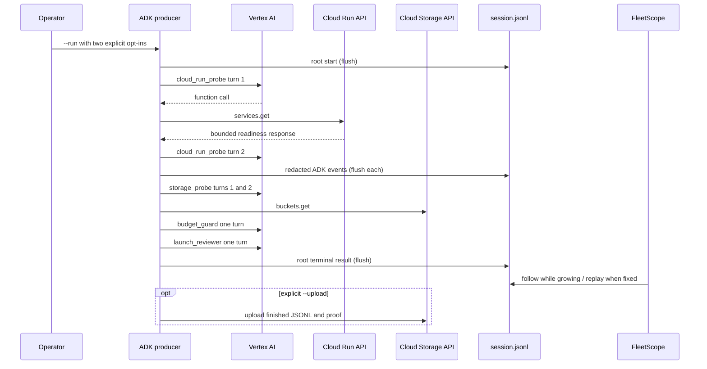

# Google hackathon runtime and demo runbook

**Status:** active local implementation; provider-backed cloud proof pending

**Last updated:** 2026-08-30

## Purpose

Run one real Gemini/Google ADK multi-agent session, persist safe append-only
JSONL, watch it with FleetScope, and optionally store the finished evidence in
Cloud Storage. This is a producer proof for the read-only Session Observer, not
an agent-control backend.

## Stack choice

- Vertex AI via ADC
- `gemini-3.7-flash` configured default
- Google ADK `2.8.0`
- Cloud Run as the hosted demo/read-only endpoint and inspected service
- Cloud Storage for optional redacted JSONL/proof artifacts
- no Firestore, Cloud SQL, Pub/Sub, queue, or transactional ledger

This minimizes cost and operational risk while meeting the required Gemini,
Google agent framework, and Google Cloud surfaces.

## Runtime sequence



## Zero-cost setup and validation

```bash
uv venv --python 3.12 apps/adk-worker/.venv
uv pip install --python apps/adk-worker/.venv/bin/python -e 'apps/adk-worker[dev]'

pnpm demo:google-session -- \
  --project example-project \
  --location us-central1 \
  --service fleetscope \
  --bucket fleetscope-sessions-demo
```

Expected: JSON plan on stdout; no `.fleetscope/sessions` directory, ADC lookup,
network request, or model call.

## Prepare Google Cloud

Use a dedicated demo project/region and least-privilege identity. Required
read permissions are equivalent to Cloud Run service viewer and Storage bucket
metadata viewer. Add object create only if `--upload` will be used.

Before the metered take, independently confirm:

```bash
gcloud auth application-default login
gcloud run services describe <service> --region us-central1 --project <project>
gcloud storage buckets describe gs://<bucket>
```

Do not put service-account JSON or API keys in the repository or proof files.

## Real run

Terminal 1:

```bash
export GOOGLE_GENAI_USE_VERTEXAI=true
export GOOGLE_CLOUD_PROJECT=<project-id>
export GOOGLE_CLOUD_LOCATION=us-central1
export FLEETSCOPE_CLOUD_RUN_SERVICE=<service-name>
export FLEETSCOPE_SESSION_BUCKET=<bucket-name>
export FLEETSCOPE_ALLOW_MODEL_CALLS=true

pnpm demo:google-session -- --run
```

Terminal 2: paste the `watch_command=` printed by Terminal 1.

After completion:

```bash
cargo run -q -p fleetscope-cli --bin fleetscope -- inspect \
  .fleetscope/sessions/<session-id>/session.jsonl
```

Only after local inspection, rerun with `--upload` if a Storage artifact is
needed. That is a second metered run; prefer uploading the already completed
local bundle manually if avoiding another model run is important. The current
CLI deliberately couples `--upload` to `--run` so it cannot upload an
unverified arbitrary file.

## Expected inspect proof

```text
session   <provider invocation id>
adapter   google-adk@1 — Google ADK / Gemini session
producer  google-adk 2.8.0 · model <provider modelVersion>
agents    5
...
launch_readiness
  cloud_run_probe
  storage_probe
  budget_guard
  launch_reviewer
```

## Video evidence capture

Capture in one continuous take:

1. Cloud Run service URL/revision in Console or `gcloud`.
2. producer command and ADK version.
3. observed model line from the same session.
4. live JSONL follow with all four children.
5. Cloud tool result and final review decision.
6. replay of the finished session.
7. proof manifest/session ID.
8. optional Storage object generation.

## Cost controls

The script permits six calls and no retry. The exact cost depends on current
Vertex pricing and token usage; do not hard-code a dollar estimate without a
fresh pricing check. The available credit is not a reason to widen the runtime.

## Known external gaps

- project/service/bucket identifiers are not selected in this checkout;
- Vertex availability and observed model version are not yet proven;
- Cloud Run deployment/hosted URL is not yet verified;
- Storage upload is not yet verified;
- launchpad QA passes across five viewports; deep viewer interaction QA remains
  unverified because the escalated Playwright process opened browser IPC but
  produced no output for 90 seconds and was stopped.

## Links

- [Session Observer design](session-observer.md)
- [Product demo brief](../product/session-observer.md)
- [Submission checklist](../product/hackathon-submission-checklist.md)
